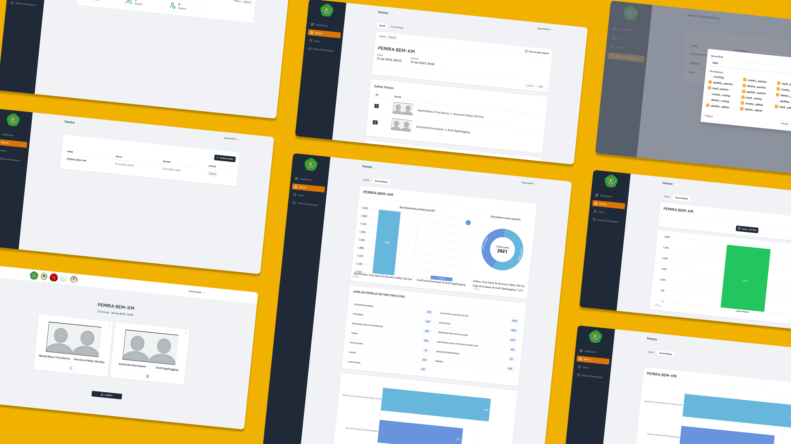

# Aplikasi PEMIRA BEM KM UNMUL 2023

#### Deskripsi

Website pemilihan raya online untuk BEM-KM Universitas Mulawarman, termasuk sebelumnya digunakan oleh BEM FISIP dan BEM Faperta. Aplikasi ini dirancang untuk mengakomodasi ribuan mahasiswa (lebih dari 5.000 user) dalam proses pemungutan suara yang aman dan efisien.

#### Fitur

<ul>
    <li>
        Autentikasi OTP: Menggunakan email SIAKAD aktif dengan berbagai filter vauldasi seperti status keaktifan dan fakultas.
    </li>
    <li>
        Manajemen Kandidat & Pemilih: Termasuk pengelolaan data, foto, dan profil calon serta pemilih.
    </li>
    <li> 
        Live Statistik Partisipasi: Menampilkan bar chart anonim untuk memantau partisipasi secara langsung.
    </li> 
    <li> 
        Race Chart Rekapitulasi Suara: Menyajikan rekapitulasi suara yang aktif setelah proses pemungutan suara ditutup.
    </li>
</ul>

#### Link

<a href="https://pemira.km.unmul.ac.id/" target="_blank" rel="noopener noreferrer">https://pemira.km.unmul.ac.id/</a>

